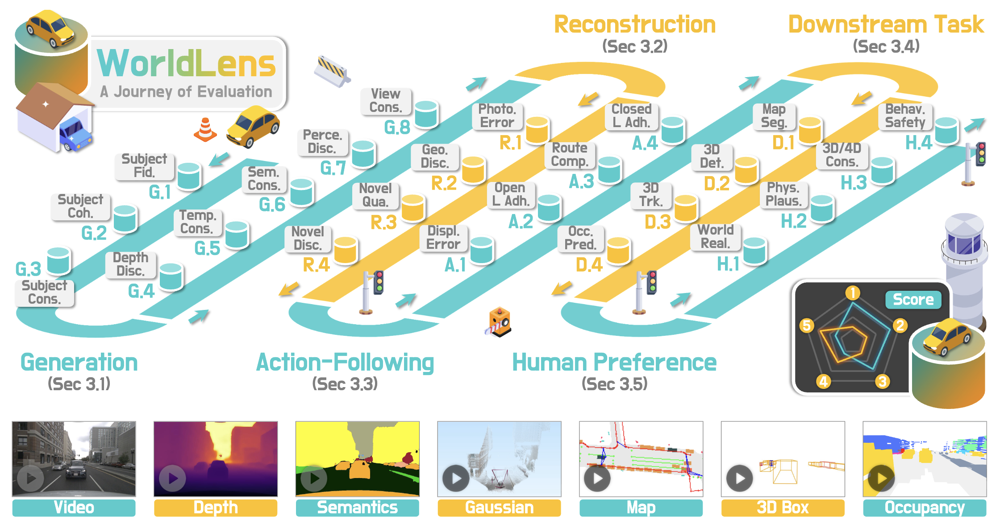

<p align="right">English | <a href="./README_CN.md">简体中文</a></p>  


<p align="center">
  

  <h1 align="center">
    <strong>WorldLens: Full-Spectrum Evaluations of Driving World Models in Real World</strong>
  </h1>

  <p align="center">
    <strong>:earth_asia: WorldBench Team</strong> 
  </p>

  <p align="center">
    <a href="" target='_blank'>
      
    </a>&nbsp;
    <a href="https://worldbench.github.io/worldlens" target='_blank'>
      
    </a>&nbsp;
    <a href="https://huggingface.co/datasets/worldbench/videogen" target='_blank'>
      
    </a>&nbsp;
    <a href="" target='_blank'>
      
    </a>
  </p>
</p>


|  |
| :-: |

### :grey_question: Is your driving world model an all-around player? 

- This work presents `WorldLens`, a unified benchmark encompassing evaluations on $^1$**Generation**, $^2$**Reconstruction**, $^3$**Action-Following**, $^4$**Downstream Task**, and $^5$**Human Preference**, across **a total of 24 dimensions** spanning visual realism, geometric consistency, functional reliability, and perceptual alignment.
- We observe no single model dominates across all axes, highlighting the need for balanced progress toward physically and behaviorally realistic world modeling.
- For additional visual examples, kindly refer to our :earth_asia: [Project Page](https://worldbench.github.io/worldlens).


### :books: Citation
If you find this work helpful for your research, please kindly consider citing our papers:

```bibtex
@article{worldlens,
    title   = {{WorldLens}: Full-Spectrum Evaluations of Driving World Models in Real World},
    author  = {Ao Liang and Lingdong Kong and Tianyi Yan and Hongsi Liu and Wesley Yang and Ziqi Huang and Wei Yin and Jialong Zuo and Yixuan Hu and Dekai Zhu and Dongyue Lu and Youquan Liu and Guangfeng Jiang and Linfeng Li and Xiangtai Li and Long Zhuo and Lai Xing Ng and Benoit R. Cottereau and Changxin Gao and Liang Pan and Wei Tsang Ooi and Ziwei Liu},
    journal = {arXiv preprint arXiv:2512.xxxxx}
    year    = {2025}
}
```
```bibtex
@article{survey_3d_4d_world_models,
    title   = {{3D} and {4D} World Modeling: A Survey},
    author  = {Lingdong Kong and Wesley Yang and Jianbiao Mei and Youquan Liu and Ao Liang and Dekai Zhu and Dongyue Lu and Wei Yin and Xiaotao Hu and Mingkai Jia and Junyuan Deng and Kaiwen Zhang and Yang Wu and Tianyi Yan and Shenyuan Gao and Song Wang and Linfeng Li and Liang Pan and Yong Liu and Jianke Zhu and Wei Tsang Ooi and Steven C. H. Hoi and Ziwei Liu},
    journal = {arXiv preprint arXiv:2509.07996},
    year    = {2025}
}
```


## Updates

- **[12/2025]** - A collection of 3D and 4D world models is avaliable at :hugs: [`awesome-3d-4d-world-models`](https://github.com/worldbench/awesome-3d-4d-world-models).
- **[12/2025]** - The [Project Page](https://e-flare.github.io) is online. :rocket:


## Outline
- [WorldLens Benchmark](#earth_asia-worldlens-benchmark)
- [Installation](#gear-installation)
- [Data Preparation](#hotsprings-data-preparation)
- [Getting Started](#rocket-getting-started)
- [WorldLens-Agent](#robot-worldlens-agent)
- [TODO List](#memo-todo-list)
- [License](#license)
- [Acknowledgements](#acknowledgements)


## :earth_asia: WorldLens Benchmark

| |
| :-: |

- Generative world models must go beyond visual realism to achieve geometric consistency, physical plausibility, and functional reliability. `WorldLens` is a unified benchmark that evaluates these capabilities across five complementary aspects - from low-level appearance fidelity to high-level behavioral realism.

- Each aspect is decomposed into fine-grained, interpretable dimensions, forming a comprehensive framework that bridges human perception, physical reasoning, and downstream utility.

For additional details and visual examples, kindly refer to our [Project Page](https://e-flare.github.io).


## :gear: Installation

The `WorldLens` evaluation toolkit is developed and tested under Python 3.9 + CUDA 11.8. We recommend using Conda to manage the environment.

- Create Environment
```shell
conda create -n worldbench python=3.9.20
conda activate worldbench
```

- Install PyTorch
```shell
pip install torch==2.1.0 torchvision==0.16.0 torchaudio==2.1.0 \
    --index-url https://download.pytorch.org/whl/cu118
```

- Install MMCV (with CUDA)
```shell
cd worldbench/third_party/mmcv-1.6.0
MMCV_WITH_OPS=1 pip install -e .
```

> **Note**:
We modified the C++ standard to C++17 for better compatibility. You may adjust it in worldbench/third_party/mmcv-1.6.0/setup.py based on your system.

- Install MMSegmentation
```shell
pip install https://github.com/open-mmlab/mmsegmentation/archive/refs/tags/v0.30.0.zip
```

- Install MMDetection
```shell
pip install mmdet==2.28.2
```

- Install BEVFusion-based MMDet3D
```shell
git clone --recursive https://github.com/worldbench/dev-evalkit.git
cd worldbench/third_party/bevfusion
python setup.py develop
```
> Additional Notes:
> 1. C++ standard was updated to C++17.
> 2. We modified the sparse convolution import logic at
`worldbench/third_party/bevfusion/mmdet3d/ops/spconv/conv.py.`

- Install MMDetection3D (v1.0.0rc6)
```shell
cd worldbench/third_party/mmdetection3d-1.0.0rc6
pip install -v -e .
```
Required dependency versions:
```shell
numpy == 1.23.5
numba == 0.53.0
```

- Pretrained Models
WorldLens relies on several pretrained models (e.g., CLIP, segmentation, depth networks). Please download them from [HuggingFace](https://huggingface.co/datasets/worldbench/videogen/tree/main/pretrained_models) and place them under: `./pretrained_models/`


## :hotsprings: Data Preparation
Here we take nuScenes as an example.
Required Files
- nuScenes official dataset
- 12 Hz interpolated annotations from [ECCV 2024 Workshop – CODA Track 2](https://coda-dataset.github.io/w-coda2024/track2/)
- Tracking & temporal .pkl files from [HuggingFace – WorldLens Data Preparation](https://huggingface.co/datasets/worldbench/videogen/tree/main/data_preparation)

**Final Directory Structure**
```Shell
data
├── nuscenes
│   ├── can_bus
│   ├── lidarseg
│   ├── maps
│   ├── occ3d
│   ├── samples
│   ├── sweeps
│   ├── v1.0-mini
│   └── v1.0-trainval
├── nuscenes_map_aux_12Hz_interp
│   └── val_200x200_12Hz_interp.h5
├── nuscenes_mmdet3d-12Hz
│   ├── nuscenes_interp_12Hz_dbinfos_train.pkl
│   ├── nuscenes_interp_12Hz_infos_track2_eval.pkl
│   ├── nuscenes_interp_12Hz_infos_train.pkl
│   └── nuscenes_interp_12Hz_infos_val.pkl
├── nuscenes_mmdet3d-12Hz_description
│   ├── nuscenes_interp_12Hz_updated_description_train.pkl
│   └── nuscenes_interp_12Hz_updated_description_val.pkl
├── nuscenes_mmdet3d_2
│   └── nuscenes_infos_temporal_val_3keyframes.pkl
└── nuscenes_track
    ├── ada_track_infos_train.pkl
    └── ada_track_infos_val.pkl
```


## :rocket: Getting Started
- Configure Metrics

All evaluation metrics are defined in a unified YAML format under `tools/configs/.`
Example: Temporal (Depth) Consistency:
```yaml
temporal_consistency:
  - name: temporal_consistency
    method_name: ${method_name}
    need_preprocessing: true
    repeat_times: 1
    local_save_path: pretrained_models/clip/ViT-B-32.pt
```

- Run Evaluation
```shell
bash tools/scripts/evaluate.sh $TASK $METHOD_NAME
```
- Example: evaluating MagicDrive (video-based world model)
```shell
bash tools/scripts/evaluate.sh videogen magicdrive
```


### Visualizations
- Prepare Generated Results
Download model outputs from [HuggingFace](https://huggingface.co/datasets/worldbench/videogen/tree/main/nuscenes) and move them to:
```shell
./generated_results
├── dist4d
├── dreamforge
├── drivedreamer2
├── gt
├── magicdrive
├── opendwm
└── xscene
    └── video_submission
```

- Visualization Tools
  - Multi-view Panorama Viewer (Cross-view Consistency)
  ```shell
  python tools/showcase/video_multi_view_app.py
  ```

  - Method-to-Method Comparison
  ```shell
  python tools/showcase/video_method_compare_app.py
  ```

  - GIF-based Comparison
  ```shell
  python tools/showcase/gif_method_compare_app.py
  ```


## :robot: WorldLens-Agent


## :memo: TODO List
- [x] Initial release. 🚀
- [ ] Release the WorldLens-26K dataset.
- [ ] Support additional datasets (Waymo, Argoverse, and more)
- [ ] Add agent-based automatic evaluators
- [ ] . . .


## License
This work is under the <a rel="license" href="https://www.apache.org/licenses/LICENSE-2.0">Apache License Version 2.0</a>, while some specific implementations in this codebase might be under other licenses. Kindly refer to [LICENSE.md](docs/LICENSE.md) for a more careful check, if you are using our code for commercial matters.


## Acknowledgements


